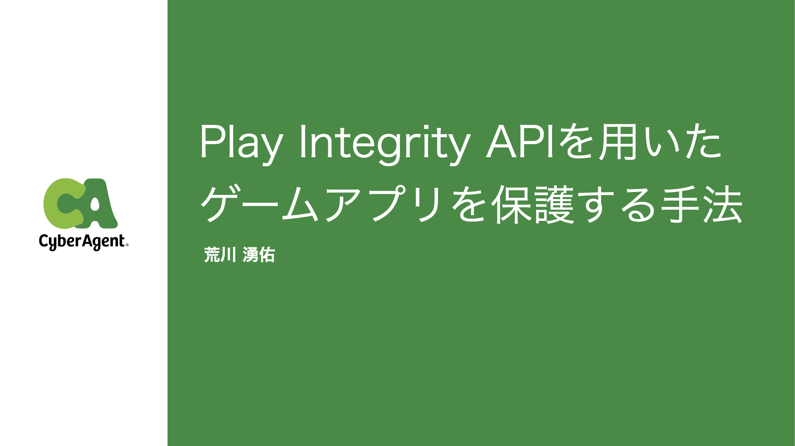

# How to protect game apps using Play Integrity API

**Abstract**:

The Play Integrity API provided by Google helps protect game apps from manipulation by tampering with application files. The API is free to use and relatively easy to implement, providing developers with a cost-effective means of detecting attacks and reducing fraud. In this talk, I will introduce the criteria for deciding whether to introduce the Play Integrity API and implementation design methods for more effective use.

* [Schedule](https://shibuya-gamesec.connpass.com/event/256890)
* [Slides](https://github.com/nekolaboratory/slidefiles/raw/main/talks/shibuya-gamesec-256890/Play_Integrity_API.pdf)